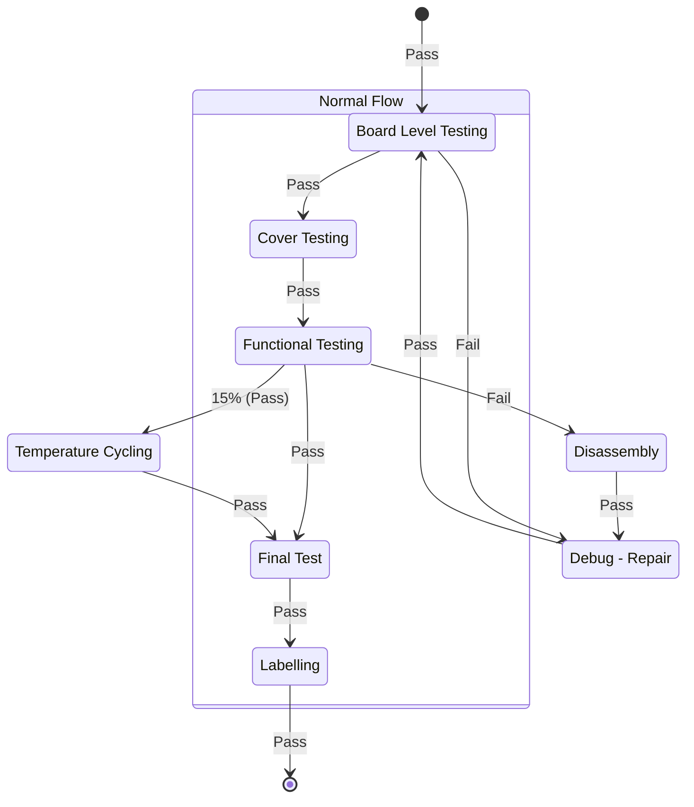

# Proligent™ Manufacturing Information Model

This page describes the manufacturing information model used by [Proligent™
Cloud][cloud] and [Proligent™ Analytics][analytics]. The model is organized into
three primary categories: processes, products, and resources.

[cloud]: https://www.averna.com/en/products/smart-data-management/proligent-cloud
[analytics]: https://www.averna.com/en/products/proligent-analytics

These categories are generally defined as follows:

- **Processes**: Represent all the actions required and business rules that must
  be followed to complete the manufacturing of products.
- **Resources**: Include the personnel and equipment available to carry out the
  processes.
- **Products**: Describe the items the company manufactures.

The components of this manufacturing model form the foundation of the data
structure and reports available in [Proligent™ Cloud][cloud] and [Proligent™
Analytics][analytics]. These components and sub-components (such as products,
processes, operations, sequences, steps, operators, and stations) serve as the
key dimensions for filtering and slicing reports.

![Manufacturing Information Model][manufacturing-information-model]

[manufacturing-information-model]: assets/manufacturing-information-model.svg

## Products

The product model is structured as a hierarchical tree that allows for flexible
and detailed product descriptions. It consists of three main entities: product
categories, products, and product units.

- **Product Categories**: Group products that share common attributes and can
  contain either products or sub-categories. The top level of the tree is the
  product catalog, which serves as the highest-level product category.
- **Products**: The final leaf in the product tree, representing a distinct type
  of product manufactured by the company, often corresponding to a
  specific version of a part number.
- **Product Units**: Manufactured instances of a product, each identified by a
  unique identifier, typically a serial number.

## Processes, Operations, Sequences, and Steps

Processes encompass the entire lifecycle that a product unit undergoes to
complete fabrication. Each process includes a series of operations
interconnected by transitions, which may enforce various business rules.

- **Operations**: Stages within a process where specific work sequences can or
  must be executed. Processes can be divided into sub-processes.
- **Sequences**: Detailed work sequences typically carried out at a specific
  station by an operator or in a single automated run. Sequences are further
  divided into subsequences that contain a series of tasks called a step list.
  Each step represents the most basic task within a sequence.

## Resources: Stations, Operators

Resources in the manufacturing model include stations and operators. The
Proligent™ station model is organized as a hierarchical tree similar to the
product model.

- **Station Groups**: Collections of stations that share common location
  attributes. They can contain stations or further sub-groups. The top level
  of the tree is the station set, representing the highest-level station
  group.
- **Stations**: The final leaf in the station tree, representing a physical
  workstation used in the manufacturing process. An automation server or
  execution console operates at these stations.

Operators are another key component of the Proligent™ manufacturing model,
serving as a dimension in the reports generated by [Proligent™ Cloud][cloud] and
[Proligent™ Analytics][analytics].
